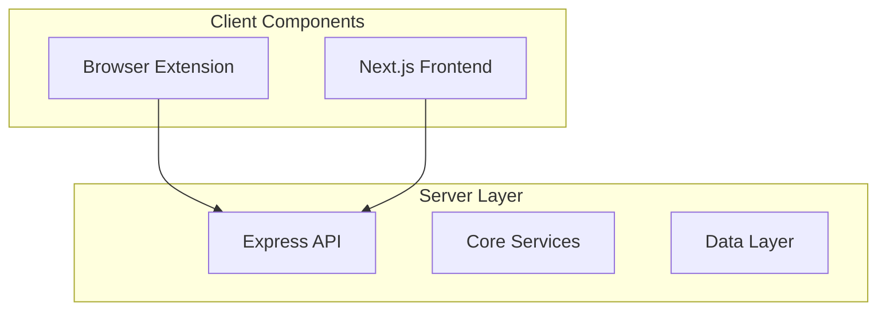
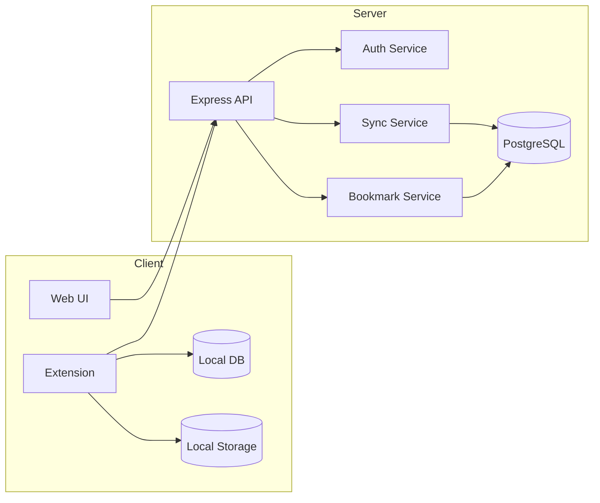
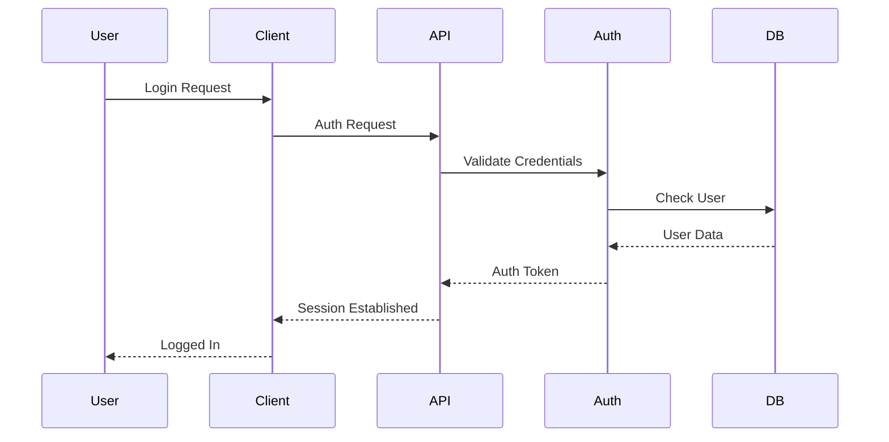
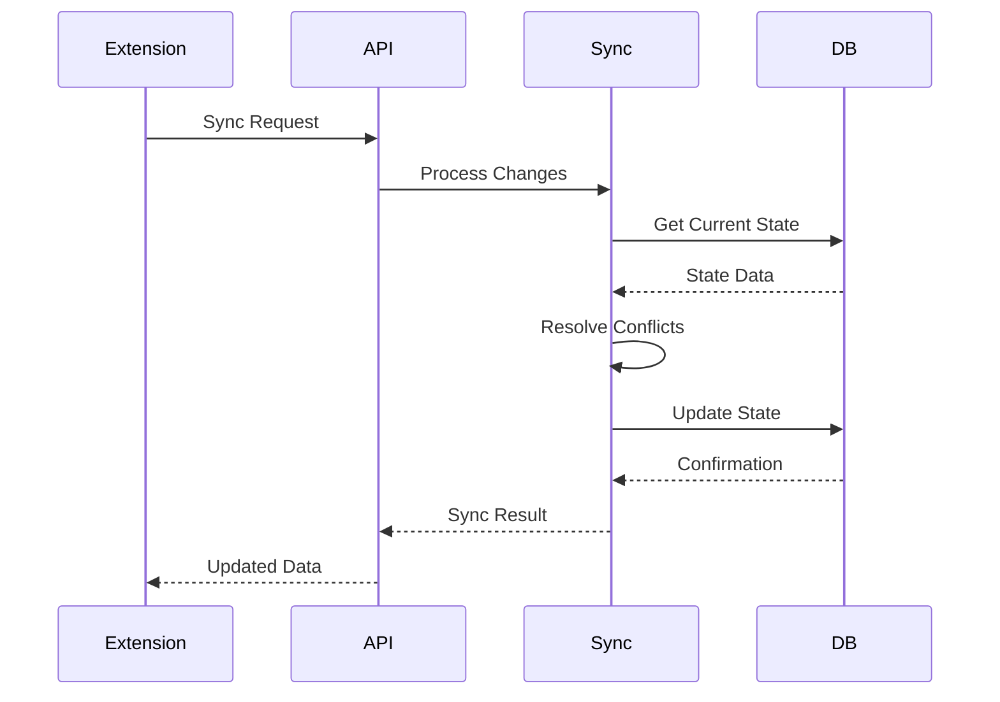

# BookMarx Core Architecture

## System Components Overview


## Core Components

### 1. Browser Extension
```typescript
interface ExtensionArchitecture {
    components: {
        background_service: {
            purpose: "Long-running processes and browser event handling";
            responsibilities: [
                "Monitor bookmark changes",
                "Handle sync scheduling",
                "Manage offline queue",
                "Process browser events",
                "Handle authentication state",
                "Initial bookmark import"
            ];
            first_run: {
                purpose: "Handle extension installation and setup";
                responsibilities: [
                    "Import existing bookmarks",
                    "Create device identifier",
                    "Initialize storage",
                    "Set default preferences"
                ];
                import_strategy: {
                    type: "BULK_IMPORT";
                    process: [
                        "Retrieve complete bookmark tree",
                        "Preserve folder structure",
                        "Maintain bookmark order",
                        "Generate server-compatible format",
                        "Queue for initial sync"
                    ];
                    metadata: [
                        "Import timestamp",
                        "Original creation dates",
                        "Folder hierarchies",
                        "Device information"
                    ];
                };
            };
        };
        content_script: {
            purpose: "Browser interaction";
            responsibilities: [
                "Listen for bookmark operations",
                "Intercept browser bookmark actions",
                "Handle browser bookmark API"
            ];
        };
        popup: {
            purpose: "User interface";
            responsibilities: [
                "Show sync status",
                "Display notifications",
                "Provide quick actions",
                "Show connection status"
            ];
        };
        options: {
            purpose: "Settings and management";
            responsibilities: [
                "Bookmark management UI",
                "Sync configuration",
                "Account settings",
                "Backup controls"
            ];
        };
    };
}
```

### 2. Website Frontend
```typescript
interface WebFrontendArchitecture {
    framework: {
        type: "Next.js";
        features: [
            "Server-side rendering",
            "API routes",
            "Static site generation",
            "Dynamic imports"
        ];
    };
    components: {
        marketing: {
            purpose: "Public-facing pages";
            pages: [
                "Landing page",
                "Features overview",
                "Pricing",
                "Documentation"
            ];
        };
        dashboard: {
            purpose: "User management interface";
            features: [
                "Bookmark management",
                "Device management",
                "Account settings",
                "Sync status"
            ];
        };
        auth: {
            purpose: "Authentication flows";
            features: [
                "Login/Register",
                "Social auth",
                "Password reset",
                "Session management"
            ];
        };
    };
    ui: {
        framework: "shadcn/ui";
        styling: "Tailwind CSS";
    };
}
```

### 3. Backend Server
```typescript
interface ServerArchitecture {
    framework: {
        type: "Express.js";
        features: [
            "RESTful endpoints",
            "Middleware support",
            "Static file serving",
            "Error handling"
        ];
    };
    components: {
        api_gateway: {
            purpose: "Request handling and routing";
            features: [
                "Rate limiting",
                "Authentication",
                "Request validation",
                "Response caching"
            ];
        };
        core_services: {
            auth_service: {
                responsibilities: [
                    "User authentication",
                    "Session management",
                    "Social auth integration",
                    "Token management"
                ];
            };
            bookmark_service: {
                responsibilities: [
                    "CRUD operations",
                    "Folder management",
                    "Tag management",
                    "Search functionality"
                ];
            };
            sync_service: {
                responsibilities: [
                    "Change detection",
                    "Conflict resolution",
                    "Version management",
                    "Device synchronization"
                ];
            };
            backup_service: {
                responsibilities: [
                    "Backup creation",
                    "Backup restoration",
                    "Version management",
                    "Storage management"
                ];
            };
        };
    };
}
```

### 4. Data Flow Architecture


## System Interactions

### 1. Authentication Flow


### 2. Sync Flow


## Security Architecture

### 1. Authentication System
```typescript
interface SecurityArchitecture {
    authentication: {
        methods: [
            "JWT tokens",
            "OAuth 2.0",
            "Device fingerprinting"
        ];
        storage: {
            tokens: "Secure local storage";
            session: "Browser session";
        };
    };
    dataProtection: {
        inTransit: "TLS 1.3";
        atRest: "AES-256";
        userSecrets: "bcrypt";
    };
}
```

### 2. Rate Limiting
```typescript
interface RateLimiting {
    tiers: {
        free: {
            requests: 100,
            period: "1 minute"
        };
        pro: {
            requests: 1000,
            period: "1 minute"
        };
    };
    rules: [
        "IP-based limiting",
        "User-based limiting",
        "Endpoint-specific limits",
        "Burst allowance"
    ];
}
```

## Error Handling Strategy
```typescript
interface ErrorHandling {
    categories: {
        network: ["Connection lost", "Timeout", "API errors"];
        sync: ["Conflicts", "Version mismatch", "Data corruption"];
        auth: ["Invalid token", "Expired session", "Permission denied"];
        data: ["Validation failed", "Storage full", "Corrupt data"];
    };
    recovery: {
        network: "Exponential backoff retry";
        sync: "Automatic conflict resolution";
        auth: "Token refresh flow";
        data: "Validation and cleanup";
    };
}
```

## Monitoring & Logging
```typescript
interface MonitoringSystem {
    metrics: [
        "API response times",
        "Sync success rates",
        "Error frequencies",
        "Resource usage"
    ];
    alerts: [
        "Service disruptions",
        "High error rates",
        "Resource constraints",
        "Security events"
    ];
    logging: {
        levels: ["DEBUG", "INFO", "WARN", "ERROR"];
        retention: "30 days";
        storage: "Local with backup";
    };
}
```

This architecture is designed to be:
1. Scalable
2. Maintainable
3. Secure
4. Reliable
5. Performance-optimized